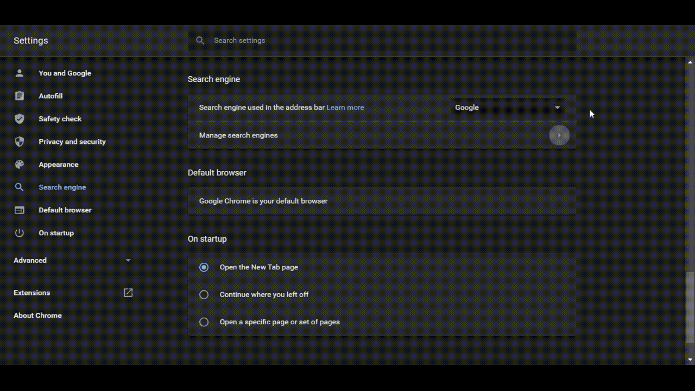

<a align="center">
  
</a>

**SRCH** is an search automation tool aimed at maximizing productivity. Search any webpage  and get the results faster than ever.

##### Hear it from the great minds
***" Time Your Search, or Search all Your Time "*** – *Ellon Musk*

Now that you heard that, let's get started!


## Usage
#### Available URL Args
- `s=` : search query
- `prefix=` : custom prefix
- `default=` : default fallback search engine<br>

**NOTE :** `default`, `prefix` are optional<br>

 Defaults:
  - `default` : [Google](https://www.google.com)
  - `prefix` : **!** 


### Customizations
 - customizable prefixes
 - customizable fallback search engines
  
#### Examples

##### Default

```bash
https://srch.sreecha.me/api/?s=
```

Fallback Search Engine : [Google](https://www.google.com)

Prefix : **!**

##### Custom Prefix

```bash
https://srch.sreecha.me/api/?prefix=@&s=
```

Fallback Search Engine : [Google](https://www.google.com)

Prefix : **@**

##### Custom Fallback Search Engine [from [Search Engine](#list-of-commands-available-presently)]]]

```bash
https://srch.sreecha.me/api/?default=duckduckgo&s=
```

Fallback Search Engine : [Bing](https://www.bing.com)

Prefix : **!**

##### Custom Prefix and Fallback Search Engine

```bash
https://srch.sreecha.me/api/?prefix=@&default=https://www.twitch.tv/&s=
```

Fallback Search Engine : [Twitch](https://www.twitch.tv/)

Prefix : **@**

**NOTE :** `default` can be an url or a [Search Engine](#list-of-commands-available-presently) name


### List of commands available presently
> **NOTE :** Use `prefix` before the `command`

<details><summary>Search Engines</summary><br>

Command| Does...
:-----:|:-----:
`google`|[google](https://www.google.com)]
`duckduckgo`|[duckduckgo](https://duckduckgo.com)
`brave`|[brave](https://search.brave.com)
`bing`|[bing](https://www.bing.com)
`ecosia`|[ecosia](https://www.ecosia.org)
`startpage`|[startpage](https://startpage.com)

</details>


<details><summary>Music</summary><br>

command| Does...
:-----:|:-----:
`spotify`|[spotify](https://open.spotify.com)
`ytmusic`|[ytmusic](https://music.youtube.com)
`genius`|[genius](https://genius.com)
`musicstax`|[musicstax](https://musicstax.com)
`soundcloud`|[soundcloud](https://soundcloud.com)
`bandcamp`|[bandcamp](https://bandcamp.com)
`applemusic`|[applemusic](https://music.apple.com)
`musixmatch`|[musixmatch](https://www.musixmatch.com)

</details>


<details><summany>Movies</summary><br>

command| Does...
:-----:|:-----:
`imdb`|[imdb](https://www.imdb.com)
`rottentomatoes`|[rottentomatoes](https://www.rottentomatoes.com)
`fandango`|[fandango](https://www.fandango.com)

</details>


<details><summary>Videos</summary><br>

command| Does...
:-----:|:-----:
`youtube` or `yt`|[youtube](https://www.youtube.com)
`netflix`|[netflix](https://www.netflix.com)
`odysee`|[odysee](https://odysee.com)
`twitch`|[twitch](https://www.twitch.tv)
`gyazo`|[gyazo](https://gyazo.com)

</details>


<details><summary>Social</summary><br>

command| Does...
:-----:|:-----:
`facebook` or `fb`|[facebook](https://www.facebook.com)
`instagram` or `ig`|[instagram](https://www.instagram.com)
`twitter`|[twitter](https://www.twitter.com)
`reddit`|[reddit](https://www.reddit.com)
`linkedin`|[linkedin](https://www.linkedin.com)
`pinterest`|[pinterest](https://www.pinterest.com)
`quora`|[quora](https://www.quora.com)
`whatsapp`|[whatsapp](https://web.whatsapp.com)
`snapchat`|[snapchat](https://www.snapchat.com)
`telegram`|[telegram](https://web.telegram.org)
`skype`|[skype](https://web.skype.com)
`slack`|[slack](https://slack.com)
`discord`|[discord](https://discord.com)
`tiktok`|[tiktok](https://www.tiktok.com)
`polywork`|[polywork](https://polywork.com)
`subso`|[sub.so](https://sub.so)


</details>


<details><summary>News</summary><br>

command| Does...
:-----:|:-----:
`bbc`|[bbc](https://www.bbc.com)
`cnn`|[cnn](https://www.cnn.com)
`nytimes`|[nytimes](https://www.nytimes.com)
`npr`|[npr](https://www.npr.org)
`washingtonpost`|[washingtonpost](https://www.washingtonpost.com)
`wsj`|[wsj](https://www.wsj.com)
`huffpost`|[huffpost](https://www.huffpost.com)
`foxnews`|[foxnews](https://www.foxnews.com)
`theguardian`|[theguardian](https://www.theguardian.com)
`theverge`|[theverge](https://www.theverge.com)
`techcrunch`|[techcrunch](https://techcrunch.com)
`techradar`|[techradar](https://techradar.com)
`reuters`|[reuters](https://www.reuters.com)
`bloomberg`|[bloomberg](https://www.bloomberg.com)
`businessinsider`|[businessinsider](https://www.businessinsider.com)
`cnbc`|[cnbc](https://www.cnbc.com)
`theatlantic`|[theatlantic](https://www.theatlantic.com)
`vox`|[vox](https://www.vox.com)
`forbes`|[forbes](https://www.forbes.com)

</details>


<details><summary>Anime</summary><br>

command| Does...
:-----:|:-----:
`anilist`|[anilist](https://anilist.co)
`myanimelist`|[myanimelist](https://myanimelist.net)
`anidb`|[anidb](https://anidb.net)
`crunchyroll`|[crunchyroll](https://www.crunchyroll.com)
`animixplay`|[animixplay](https://animixplay.to)

`animeflv`|[animeflv](https://animeflv.net)
`anime-planet`|[anime-planet](https://anime-planet.com)
`anime-news`|[anime-news](https://anime-news.com)
`kitori`|[kitori](https://kitori.com)
`gogoanime`|[gogoanime](https://gogoanime.com)

</details>


<details><summary>.new</summary><br>

command| Does...
:-----:|:-----:
`figma`|[figma](https://www.figma.new)
`meet`|[meet](https://meet.new)
`repo`|[repo](https://repo.new)
`gist`|[gist](https://gist.new)
`docs`|[docs](https://docs.new)
`slides`|[slides](https://slides.new)
`pastebin`|[pastebin](https://pastebin.com)
`hastebin`|[hastebin](https://www.toptal.com/developers/hastebin/)
`ghostbin`|[ghostbin](https://ghostbin.com)
`imperial`|[imperial](https://imperialb.in/)

</details>


<details> <summary>Programming</summary><br>

command| Does...
:-----:|:-----:
`git`|[github](https://github.com) [Repo]
`github`|[github](https://github.com) [User]
`gitlab`|[gitlab](https://gitlab.com)
`stackoverflow` or `overflow`|[stackoverflow](https://stackoverflow.com)
`codepen`|[codepen](https://codepen.io)
`replit`|[repl.it](https://repl.it)
`crates`|[crates.io](https://crates.io)
`rust`|[rust-lang.org](https://doc.rust-lang.org)
`gitea`|[gitea](https://gitea.com)
`gopkg`|[gopkg.in](https://gopkg.in)
`lighthouse`|[lighthouse.io](https://lighthouse.io)
`tsplay`|[tsplay](https://typescriptlang.org/play)
`docker`|[docker](https://hub.docker.com)
`tailwind`|[tailwindcss](https://tailwindcss.com/docs)
`dpy`|[discord.py](https://discordpy.readthedocs.io)
`djs`|[discord.js](https://discord.js.org)
`fa`|[fontawesome](https://fontawesome.com/)
`fonts`|[google fonts](https://fonts.google.com)

</details>


<details><summary>Package Managers</summary><br>

command| Does...
:-----:|:-----:
`npm`|[npm](https://www.npmjs.com)
`yarn`|[yarn](https://yarnpkg.com)
`pip`or `pipy`|[pip](https://pypi.org)
`brew`|[homebrew](https://brew.sh)
`aur`|[aur](https://aur.archlinux.org)
`packagist`|[packagist](https://packagist.org)

</details>


<details><summary>Domain</summary><br>

command| Does...
:-----:|:-----:
`namelix`|[namelix](https://namelix.com)
`namecheap`|[namecheap](https://www.namecheap.com)
`googledomains`|[googledomains](https://www.google.com/domains)

</details>


<details><summary>Shopping</summary><br>

command| Does...
:-----:|:-----:
`amazon`|[amazon](https://www.amazon.com)
`ebay`|[ebay](https://www.ebay.com)
`newegg`|[newegg](https://www.newegg.com)
`geizhals`|[geizhals](https://www.geizhals.at)

</details>


<details><summary>Other</summary><br>

command| Does...
:-----:|:-----:
`gmail`|[gmail](https://mail.google.com)
`gdrive`|[google drive](https://drive.google.com)
`wikipedia`|[wikipedia](https://en.wikipedia.org)
`trello`|[trello](https://trello.com)
`producthunt`|[producthunt](https://www.producthunt.com)
`img`|[Google Images](https://imgage.google.com)
`urban`|[Urban Dictionary](https://www.urbandictionary.com)
`maps`|[Google Maps](https://www.google.com/maps)
`libgen`|[Liberary Genisis](https://libgen.li)
`imgflip`|[imgflip](https://imgflip.com)


</details>


<details><summary>misc</summary><br>

command| Does...
:-----:|:-----:
`dns`|[dns](https://nslookup.io)
`ip`|[ip](https://ipinfo.io)
`speedtest`|[speedtest](https://speedtest.net)
`tor`|[tor](https://check.torproject.org/)
`geoip`|[geoip](https://geoip.com)

</details>

#### Special

<details><summary>✨ Does Not Need Prefix</summary><br>
  
command| Does...
:-----:|:-----:
`r/`|reddit thread
`u/`|reddit user
`lh`|localhost:3000
`lh:{port}`|localhost:{port}

</details>

---
## Make it your Default Search Engine:



---

## Why I made this?
Well, this is for my school project. I couldnt think of any great idea, so made this simple one. Inspired by [alii/search](https://github.com/alii/search)

That is exactly it uses sqlite to store the data.

**NOTE :** This is the `project` branch. 
[For the fastest version, check out the [`master`]() branch]

### The Project Synopsis
`ps :` it is not very gr8, and dont judge me :)

<br>
<p align="center">
  
</p>
<br>

---

### Contributing

1. Fork it (<https://github.com/sreechar/srch/fork>)
2. Create your feature branch (`git checkout -b feature/fooBar`)
3. Commit your changes (`git commit -am 'Add some fooBar'`)
4. Push to the branch (`git push origin feature/fooBar`)
5. Create a new Pull Request

#### General Ideas for Contributors

- [ ] A settings Page to change the prefix and the default search engine
- [ ] Ability to add user defined commands

<br>

- If you face any problem or cannot understand anything, open up an **issue**.
- You can also edit the **readme** and make it more user friendly to help out new contributors.
- If you have any suggestions, open up an **issue** and we'll try to implement them.

<br>

> Note: Kindly have interpretable & good commit messages. Don't assume me to be some **Jedi** with powers to be able to make out every commit with a single word as message.

<br>

*May the Force be with you.*

